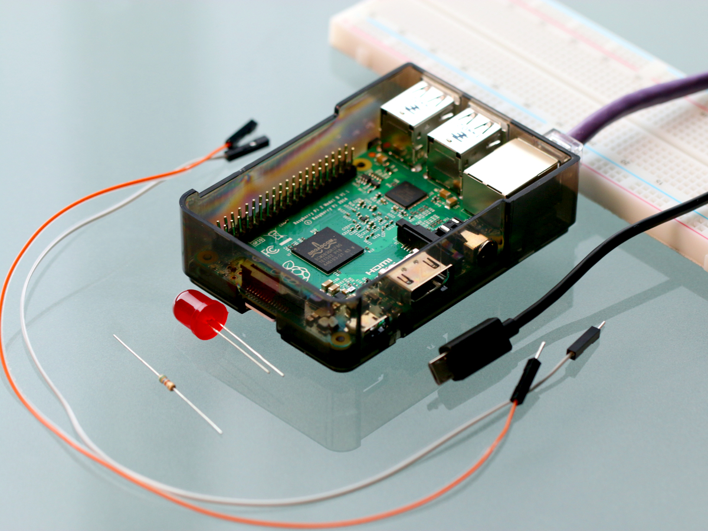
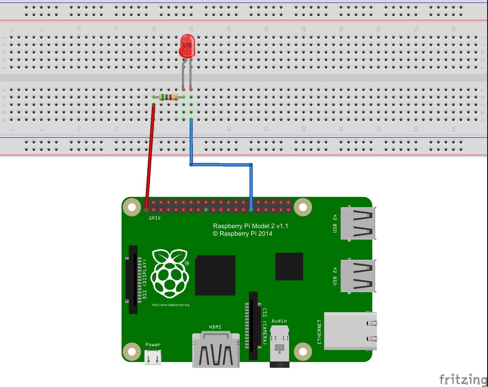
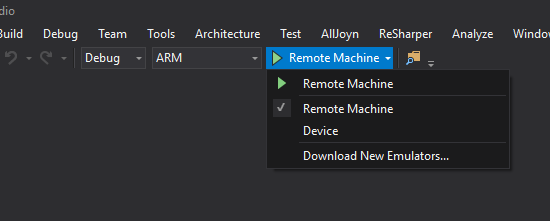

1. [Overview of Starter Pack](../README.md)
1. Blinky Sample

# Blinky Sample

Let's create a simple Blinky app using an LED to test your setup.

### Load the project in Visual Studio

You can find the source code for this sample by downloading a zip of all of our samples [here](https://github.com/ms-iot/adafruitsample/archive/master.zip) and navigating to the `Blinky`.  The sample code is available in either C++ or C#, however the documentation here only details the C# variant. Make a copy of the folder on your disk and open the project from Visual Studio.

### Connect the LED to your Windows IoT device

You'll need a few components:

* a LED (any color you like)

* a 560 &#x2126; resistor ([Resistor Color Code](https://en.wikipedia.org/wiki/Electronic_color_code) Green, Blue, Brown, Gold)

* a breadboard
* 2 Male to Female connector wires

Configure the components like this:

### Deploy your app

1. With the application open in Visual Studio, set the architecture in the toolbar dropdown to `ARM`.

2. Next, in the Visual Studio toolbar, click on the `Local Machine` dropdown and select `Remote Machine` 

    

3. At this point, Visual Studio will present the **Remote Connections** dialog. If you previously set a unique name for your device, you can enter it here.
Otherwise, use the IP address of your Windows IoT Core device. After entering the device name/IP select `Universal` for Windows Authentication, then click **Select**.

4. You can verify or modify these values by navigating to the project properties (select **Properties** in the Solution Explorer) and choosing the `Debug` tab on the left.

When everything is set up, you should be able to press F5 from Visual Studio to deploy the code.

Congratulations! You controlled one of the GPIO pins on your Windows IoT device.

### [Continue to the next project](./WorldMapOfMakers.md)

